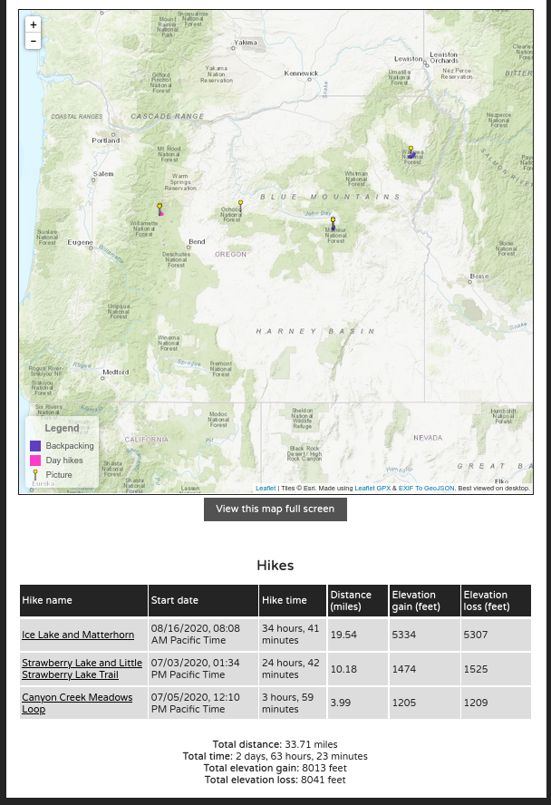

# Trail Tracker

## About
This package displays data, pictures, and statistics of recorded hikes, or any other GPX recordings. Just input your gpx data and pictures and this package will generate HTML pages with a map of all of your hikes and pictures, a table of information about all of your hikes, and an information page for each of your hikes with a map, associated pictures, elevation profile, and a 3D visualization of your route. This package is in beginning stages and is still under construction, and improvements are welcome with pull requests.

This package includes sample gpx recordings of hikes and jpg images to use as a template.

## Preview
This package is used on my website at [www.sygreer.com/hiking/](www.sygreer.com/hiking/).

## Screenshots

## Packages used
This package builds off of (sometimes modified versions of) the packages below:
- [Leaflet](https://leafletjs.com/)
- [Leaflet GPX](https://github.com/mpetazzoni/leaflet-gpx)
- [EXIF to GeoJSON](https://github.com/hallahan/exif-to-geojson)
- [gpxpy](https://github.com/tkrajina/gpxpy)
- [Plotly](https://plotly.com/)

You need [Node.js](https://github.com/nodejs/node) and Python to generate the pages

## How to use
1. Clone this repository
2. For every hike, make a directory with a name of your chosing in hikes/
3. Place the .gpx file for the corresponding hike in that directory. Please ensure that the name of the .gpx file is the same name as the directory it's in.
4. (optional) Place pictures in that directory. If you have pictures that aren't associated with a specific hike, you can add them to the directory hikes/other
5. (optional) Add a file called more.html in that directory if you'd like to add more information about that hike on that page
6. run 'node exif-to-geojson'
7. Edit the variables 'dayHikes' and 'backpacking' in map.html to include all names of your hikes that you want to include on the hiking map in their respective arrays
8. run 'python genProject.py'

If all goes well, you can open start a webserver in the trailTracker directory and view information about all of your hikes. You can additionally edit index.html, map.html, and mapTemplate.html to further customize how the result looks.

## Need help?
If you have any questions or need help, feel free to contact me via my GitHub profile. If you have any improvements, please submit a pull request. Have fun :)
